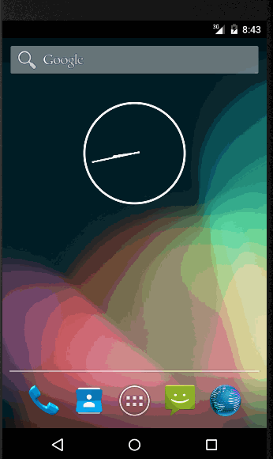
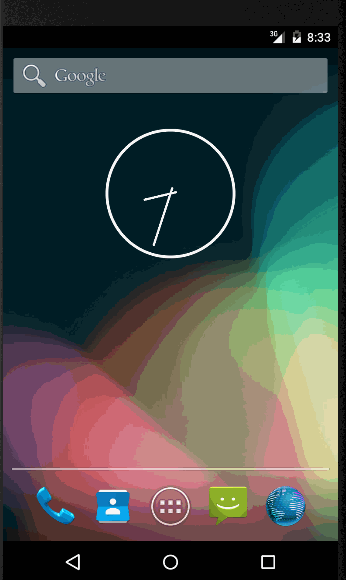

# codepath-todo by naveenkollipara (naveengrad@gmail.com ~ Sr eCommerce Developer at Macys Inc ~ 949-573-6567)
My first android app developed for CodePath assignment

This is a demo application for adding, deleting, updating and displaying Todo items using SQLite and File persistence
minSDKVersion: API 16
Demo GIFs are included for both SQLite and File persistence
Time spent: 50 hours spent in total

Completed user stories:

 1) Required: User can view a list of Todo items
 2) Required: User can add an item
 3) Required: User can edit an item by clicking it. Edited item on edit screen can be updated
 4) Required: User can remove an item by long clicking it. 
 
 5) Optional: Developed the app in two versions using File persistence and SQLite database persistence
 6) Optional: Used custom adapters for displaying list items (star image is shown along with each list item)
 7) Optional: CodePath image is used on Main Todo screen
 8) Optional: Validations if user tries to add empty item or update an item with empty value
 9) Optional: For user notifications used Alert Dialog (Edit item screen) and several Toast messages (Main screen)
 10) Optional: At the time of app launch, 'crowd cheer' audio (Media Player) plays - Enjoy the applause..!! :)
 
 
Notes:

 1) Though I have 11 years of experience in IT industry, mainly in back-end development, brand new to android development.
 2) With pure passion to get short-listed and learn from expert instructors, researched and developed this app.
 3) Tried my best to devote time for this, though busy with my 5 months baby and office work.
 4) I came to know through a friend about this bootcamp only couple of weeks ago. If I had known it bit earlier and have more     free time.. would have completed other suggested improvements as well
 
 Technical:
 1) Used Singleton (SQLite: single db instance) and Data Access Object design patterns
 2) Used Enterprise application folder structure
 3) Heavily documented and logged(using android.util.Log)
 4) SQLite vs File: In AndroidManifest.xml please use below activities for SQLite vs File persistence        
	SQLite: 
		Main activity name: .activity.TodoUsingSQLiteActivity
		database name: items.db			
        File: 
		Main activity name: activity.TodoUsingSQLiteActivity
		file name: todo.txt

Walkthrough of all user stories:
 
<b>1) using SQLite persistence</b>

<b>2) using File persistence</b>

